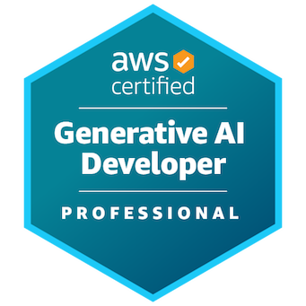

# Daniel Iván Parra Verde · GenAI & ML Solutions Architect 🇲🇽

## 🚀 Featured Production Architectures

- **[Autonomous FinOps Agent](https://github.com/danivpv/finops-agent)** · *Full-Stack GenAI on AWS*
  Live cloud economics agent built with AWS CDK, Bedrock AgentCore Gateway, and Next.js on Amplify.
  👉 **[Try Live Demo](https://main.d1e2bsg3elvnb4.amplifyapp.com/)**
- **[Enterprise ML Platform](https://github.com/danivpv/ml-platform)** · *Production MLOps Infrastructure*
  2-stack AWS CDK platform isolating Feast (feature store) and MLflow (champion registry) within private VPC subnets.
  👉 **[Read Architecture Post](https://danivpv.com/blog/beyond-the-notebook)**
- **[ArXiv Domain Expert LLM](https://github.com/danivpv/LLM-ArXiv-Domain-Expert)** · *Domain Fine-Tuning on SageMaker*
  Fine-tuned Llama-3.2-3B on AWS SageMaker with curated domain datasets and vector retrieval via Qdrant.

## 🛠️ Core Stack

- **AI & ML**: PyTorch · scikit-learn · Spark · AWS AgentCore · LangChain · LlamaIndex · Hugging Face · DSPy · Docling
- **Cloud & DevOps**: AWS · Docker · Terraform · GitHub Actions · Bash
- **Backend & Data**: Python · FastAPI · PostgreSQL · Temporal · TypeScript · Next.js

## 🏅 Certifications

## 📝 Recent Technical Writing

Architectural deep-dives on enterprise ML systems at **[danivpv.com/blog](https://danivpv.com/blog)**:

- **[Beyond the Notebook: The Operational Reality of an Enterprise ML Platform](https://danivpv.com/blog/beyond-the-notebook)** · *Dual feature stores, `@champion` aliases, and Fargate compute*
- **[The API Boundary: Enterprise Networking and Stateful ML Orchestration](https://danivpv.com/blog/the-api-boundary-and-stateful-orchestration)** · *VPC private subnets, ALB/NAT routing, and CQRS catalog APIs*
ation, private subnets, ALB/NAT & CQRS API |
