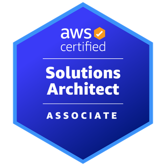

# Daniel Iván Parra Verde · ML Engineer 🇲🇽

[-2EA043?style=for-the-badge)](https://www.linkedin.com/in/danivpv/)

ML Engineer from Mexico building production AI systems and ML platforms. At **[Arkham Technologies](https://www.arkham.tech/es)**, I engineered context-aware behavior for an AI agent serving 100+ weekly users and designed parallel training workflows on AWS EMR that scaled 1K models 100× faster. I specialize in the stack between model and user: distributed compute, workflow orchestration, LLM evaluation, and end-to-end CI/CD automation.

Previously shipped deployable AI agent MVPs at MXAI, optimized retail forecasting RNNs at Kuona, and built RAG pipelines at Entropía AI. Role-specific CVs (MLOps, Production AI, Full Stack) are in [`pdfs/`](pdfs/).

---

## 🛠️ Core Stack

- **AI & ML**: DSPy · PyTorch · Hugging Face · scikit-learn · OpenAI · Anthropic · Gemini · Langchain · Llamaindex
- **Infra & Orchestration**: AWS (EMR, ECS Fargate, CDK, S3, DynamoDB, RDS, EventBridge) · Temporal · Spark · Docker · GitHub Actions
- **Backend & Data**: FastAPI · PostgreSQL · Redis · SQLAlchemy · Alembic
- **Languages**: Python · SQL · TypeScript · Bash

---

## 🏅 Certifications

---

## 📝 Engineering Blog

Building in public at **[danivpv.com/blog](https://danivpv.com/blog)**. Every post is grounded in working code, architectural decisions, and hard-won lessons.

| # | Title | Published |
|---|---|---|
| ML-01 | [Beyond the Notebook: The Operational Reality of an Enterprise ML Platform](https://danivpv.com/blog/beyond-the-notebook) | Jul 2026 |
| ML-02 | [The API Boundary: Enterprise Networking and Stateful ML Orchestration](https://danivpv.com/blog/the-api-boundary-and-stateful-orchestration) | Aug 2026 |

